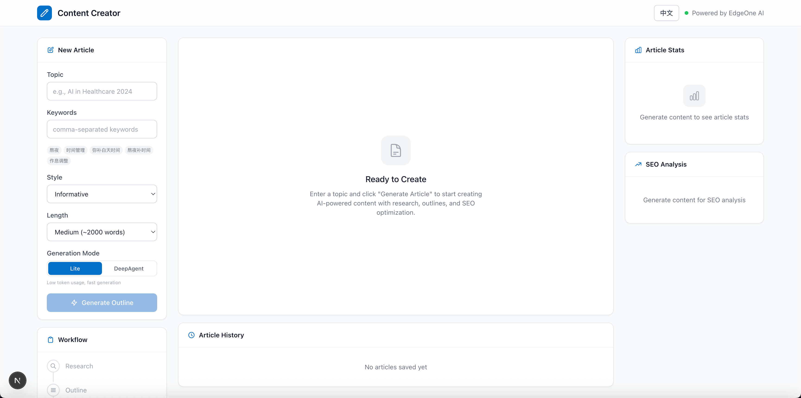

# Content Creator（内容创作助手）

**语言：** [English](./README.md) | 简体中文

基于 DeepAgents + LangChain 构建、部署在 EdgeOne Makers 上的 AI 内容创作助手，支持实时联网搜索、大纲生成、文章写作、SEO 分析与版本管理。

**Framework:** None (raw Node.js) · **Category:** Content · **Language:** TypeScript

[](https://edgeone.ai/makers/new?template=content-creator-edgeone&from=within&fromAgent=1&agentLang=typescript)

<!-- TODO: confirm -->


## Overview

本模板将长文内容创作从选题到成稿全流程自动化。通过实时联网搜索获取最新参考资料，生成结构化大纲供人工审核，再以轻量或深度模式撰写完整文章，并提供 SEO 评分与段落级精修。所有文章版本与用户偏好均跨会话持久化。

- **调研驱动写作** — 在动笔前通过真实网页搜索收集最新参考资料。
- **人机协同大纲** — AI 生成结构化大纲，用户在写作阶段前进行审阅与修改。
- **双模式生成** — Lite 模式（低 Token 手动工具循环）追求速度，DeepAgent 模式（完整框架 + 记忆）提供更丰富的个性化内容。
- **SEO 与精修** — 自动分析关键词密度、可读性与标题结构；支持按段落或全文进行指令式精修。
- **版本管理** — 文章与用户偏好持久化到 Blob 存储，支持历史回滚与跨会话续写。

## Environment Variables

| 变量 | 必填 | 说明 |
|----------|----------|-------------|
| `AI_GATEWAY_API_KEY` | 是 | 模型网关 API Key。使用 Makers Models 的 API Key，或任何兼容 OpenAI 协议的提供商 Key。 |
| `AI_GATEWAY_BASE_URL` | 是 | 网关基础地址。使用 Makers Models 时填写 `https://ai-gateway.edgeone.link/v1`。 |
| `BLOB_PROJECT_ID` | 否 | Pages 项目 ID，用于 Blob 存储（文章历史与偏好）。 |
| `BLOB_TOKEN` | 否 | Blob 存储的 API Token。 |

本模板遵循 OpenAI 兼容标准 —— 可指向 Makers Models 或任何兼容提供商。

### 如何获取 AI_GATEWAY_API_KEY

1. 打开 Makers 控制台（https://console.cloud.tencent.com/edgeone/makers）
2. 登录并启用 Makers
3. 进入 Makers → Models → API Key，创建 Key
4. 将其填入 `AI_GATEWAY_API_KEY`

> 内置模型在额度内免费，适合验证；生产环境请绑定自费厂商 Key（BYOK）。

## 本地开发

**前置依赖**
- Node.js 18+
- EdgeOne CLI（`npm i -g @edgeone/cli`）

```bash
npm install
cp .env.example .env
# 编辑 .env，填入 AI_GATEWAY_API_KEY 与 AI_GATEWAY_BASE_URL
edgeone makers dev
```

本地可观测面板地址：http://localhost:8080/agent-metrics。

## 项目结构

```
content-creator-edgeone/
├── agents/
│   ├── _shared.ts              # 模型初始化、环境校验、日志
│   ├── create.ts               # POST /create —— DeepAgent 模式写作（SSE）
│   ├── create-lite.ts          # POST /create-lite —— Lite 模式写作（SSE）
│   ├── outline.ts              # POST /outline —— 结构化大纲生成（JSON）
│   ├── optimize.ts             # POST /optimize —— SEO 分析（JSON）
│   ├── refine.ts               # POST /refine —— 文章编辑（SSE）
│   ├── research.ts             # POST /research —— 独立调研 Agent（SSE）
│   ├── stop.ts                 # POST /stop —— 中止运行
│   ├── suggest-keywords.ts     # POST /suggest-keywords —— 关键词建议（JSON）
│   └── test.ts                 # POST /test —— 模型连通性测试
├── cloud-functions/
│   ├── articles/               # POST /articles —— 文章增删改查 + 版本管理
│   ├── health/                 # GET /health
│   └── preferences/            # POST /preferences —— 用户偏好读写
├── app/                        # Next.js App Router 前端
├── components/                 # UI 组件（编辑器、SEO 面板、历史、导出）
├── lib/
│   └── i18n.tsx                # 中 / 英翻译
└── edgeone.json                # EdgeOne 部署配置
```

以 `_` 为前缀的文件是私有模块，不会作为公共路由暴露。

## 工作原理

### 运行模式
`agents/` 下的 Agent 默认以**无状态 HTTP 处理器**运行。写作端点（`/create`、`/create-lite`、`/refine`、`/research`）通过 Server-Sent Events（SSE）实时流式输出；大纲、优化与关键词端点直接返回 JSON。

### 端到端流程

1. **输入选题** —— 用户输入主题；前端调用 `/suggest-keywords` 获取 SEO 关键词建议。
2. **生成大纲** —— 前端调用 `/outline`，传入主题、关键词、风格与目标长度。Agent 返回结构化 JSON 大纲（标题、章节、要点、字数）。
3. **人工审阅** —— 用户在界面中编辑并确认大纲。
4. **文章写作** —
   - **Lite 模式**（`/create-lite`）：轻量 `bindTools` 循环，先调用一次 `search_web`，再以最小 Token 开销流式输出全文。
   - **DeepAgent 模式**（`/create`）：完整 DeepAgent 循环，携带用户记忆（风格、长度、语气偏好）与结构化系统提示，生成更丰富内容。
5. **SEO 分析** —— 写作完成后，前端调用 `/optimize` 评分关键词密度、可读性与标题结构。
6. **精修** —— 用户选中某段落或全文，调用 `/refine` 并给出指令；Agent 流式输出修改后的文本。
7. **持久化** —— 文章版本通过 `/articles` 保存到 Blob；用户偏好通过 `/preferences` 持久化。

### 关键路由与参数
- `/outline` —— 接收 `{ topic, keywords, style, length }`，返回 `{ outline, usage }`。
- `/create` 与 `/create-lite` —— 接收 `{ message, topic, keywords, style, length, outline }`，流式推送 `ai_response`、`tool_call`、`tool_result` 与 `usage` 事件。
- `/refine` —— 接收 `{ article, instruction, section }`，流式输出修改后文本。
- `/optimize` —— 接收 `{ content, keywords }`，返回 SEO JSON。
- `/stop` —— 取消某对话的活跃 SSE 流。

### 运行参数
未自定义 Agent 超时，使用平台默认值。

## 相关资源

- [Makers Agents 文档](https://edgeone.ai/makers)
- [Makers 快速开始](https://edgeone.ai/makers/docs/quickstart)
- [Makers Models](https://console.cloud.tencent.com/edgeone/makers/models)

## 许可证

MIT
